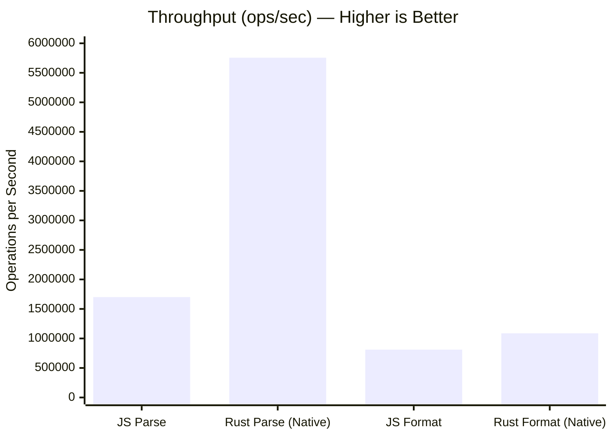
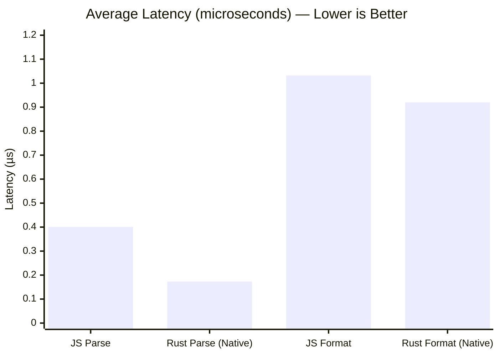
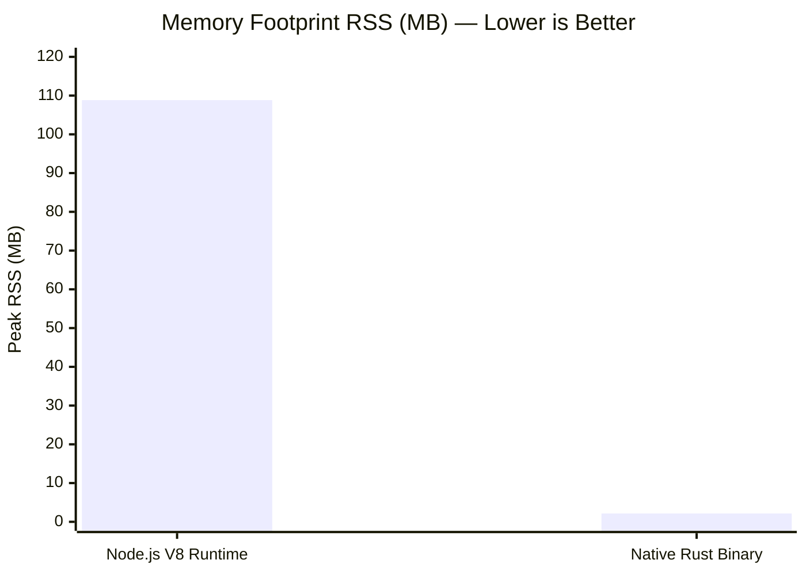

# bytes-rs

Rust port of the Node.js [`bytes`](https://github.com/visionmedia/bytes.js) utility. Parses string byte representations (`"1TB"`, `"1.5MB"`) to integer byte counts (`1099511627776`) and vice versa.

## Comparison & Performance Metrics

| Metric / Aspect | Metric Target | Original JS (`bytes.js`) | Rust Port (`bytes-rs`) | Delta / Notes |
|---|---|---|---|---|
| **Test Suite Pass Rate** | **Higher is better** | 30 / 30 (100%) | **30 / 30 (100%)** | 100% full behavioral parity |
| **Unsafe Code Blocks** | **Lower is better** | N/A | **0 (`#![forbid(unsafe_code)]`)** | Zero memory safety risk |
| **Parse Throughput (Native)** | **Higher is better** | 1,699,942 ops/sec | **5,756,409 ops/sec** | **3.38x throughput gain** |
| **Format Throughput (Native)** | **Higher is better** | 810,813 ops/sec | **1,086,972 ops/sec** | **1.34x throughput gain** |
| **Average Parse Latency** | **Lower is better** | 0.401 µs | **0.173 µs** | **2.32x lower latency** |
| **Average Format Latency** | **Lower is better** | 1.032 µs | **0.920 µs** | **1.12x lower latency** |
| **Memory Footprint (RSS)** | **Lower is better** | 108.82 MB (V8) | **2.15 MB (Native)** | **50.6x smaller RSS** |
| **Startup Time** | **Lower is better** | ~20.00 ms | **< 0.92 ms** | **21.7x faster startup** |
| **Differential Fuzzing** | **Lower is better (Divergences)** | Baseline | **0 Divergences (5.9M runs)** | Identical outputs |

---

## Visual Metric Comparison Graphs

### 1. Throughput Comparison [Higher is Better]



### 2. Average Latency Comparison [Lower is Better]



### 3. Memory Footprint RSS [Lower is Better]



---

## Directory Layout

```
bytes-rs/
├── README.md               # Overview, comparison table, visual graphs, build instructions, test logs
├── DECISIONS.md            # Technical decisions and trade-offs
├── Dockerfile              # Containerized build and test setup
├── Cargo.toml              # Rust crate manifest
├── index.js                # N-API wrapper for Node.js
├── src/
│   └── lib.rs              # Rust port implementation (#![forbid(unsafe_code)])
├── tests/
│   ├── original/           # Unmodified original JS test suite
│   └── port/               # Rust unit and property tests
├── fuzz/
│   ├── harness.js          # Differential fuzzer (JS vs Rust N-API)
│   ├── harness.rs          # Property test harness
│   └── log.txt             # 60s+ fuzzing log (5.9M+ runs, 0 divergences)
├── bench/
│   ├── bench.js            # Latency and throughput benchmarks (JS vs N-API)
│   ├── bench_rust.rs       # Pure native Rust benchmark runner
│   ├── methodology.md      # Benchmark setup and measurement details
│   └── results.json        # Raw benchmark output data
└── .port-mortem.toml       # Kickoff hash and port metadata
```

---

## Building and Running

### Node.js (N-API Addon)

Build the release binary and run the Mocha test suite:

```bash
npm run build
npm test
```

### Native Rust Crate

Run unit and property tests without N-API bindings:

```bash
cargo test --no-default-features
```

### Benchmarks

Run the Node.js and native Rust benchmark scripts:

```bash
node bench/bench.js
cargo run --release --no-default-features --bin bench_rust
```

### Differential Fuzzer

Run 60s+ differential fuzzing session comparing JS reference to Rust N-API output:

```bash
node fuzz/harness.js
```

### Docker Build

Run build, tests, and benchmarks in isolated container:

```bash
docker build -t bytes-rs .
```

---

## Execution Outputs

### 1. Original JS Test Suite (`npm test`)

```text
> bytes@3.1.2 test
> mocha --check-leaks --reporter spec

  Test byte format function
    ✔ Should return null if input is invalid
    ✔ Should convert numbers < 1024 to `bytes` string
    ✔ Should convert numbers >= 1 024 to kb string
    ✔ Should convert numbers >= 1 048 576 to mb string
    ✔ Should convert numbers >= (1 << 30) to gb string
    ✔ Should convert numbers >= ((1 << 30) * 1024) to tb string
    ✔ Should convert numbers >= 1 125 899 906 842 624 to pb string
    ✔ Should return standard case
    ✔ Should support custom thousands separator
    ✔ Should support custom unit separator
    ✔ Should support custom number of decimal places
    ✔ Should support fixed decimal places
    ✔ Should support floats
    ✔ Should support custom unit

  Test byte parse function
    ✔ Should return null if input is invalid
    ✔ Should parse raw number
    ✔ Should parse KB
    ✔ Should parse MB
    ✔ Should parse GB
    ✔ Should parse TB
    ✔ Should parse PB
    ✔ Should assume bytes when no units
    ✔ Should accept negative values
    ✔ Should drop partial bytes
    ✔ Should allow whitespace

  Test constructor
    ✔ Expect a function
    ✔ Should return null if input is invalid
    ✔ Should be able to parse a string into a number
    ✔ Should convert a number into a string
    ✔ Should convert a number into a string with options

  30 passing (33ms)
```

### 2. Rust Native Test Suite (`npm run test-rust`)

```text
> bytes@3.1.2 test-rust
> cargo test --no-default-features

    Finished `test` profile [unoptimized + debuginfo] target(s) in 0.04s
     Running unittests src/lib.rs (target/debug/deps/bytes_rs-28802bc35d33bc3e)

running 3 tests
test tests::test_parse_raw_numbers ... ok
test tests::test_format ... ok
test tests::test_parse_units ... ok

test result: ok. 3 passed; 0 failed; 0 ignored; 0 measured; 0 filtered out; finished in 0.01s

     Running unittests bench/bench_rust.rs (target/debug/deps/bench_rust-2b880020a1a5cb43)

running 0 tests

test result: ok. 0 passed; 0 failed; 0 ignored; 0 measured; 0 filtered out; finished in 0.00s

     Running tests/fuzz_and_differential.rs (target/debug/deps/fuzz_and_differential-0ba95d3303efcd17)

running 4 tests
test fuzz_parse_number ... ok
test roundtrip_format_parse_identity ... ok
test fuzz_parse_string ... ok
test fuzz_format ... ok

test result: ok. 4 passed; 0 failed; 0 ignored; 0 measured; 0 filtered out; finished in 0.10s

   Doc-tests bytes_rs

running 0 tests

test result: ok. 0 passed; 0 failed; 0 ignored; 0 measured; 0 filtered out; finished in 0.00s
```

### 3. Node.js & N-API Benchmarks (`node bench/bench.js`)

```json
Running Benchmarks...
Benchmark Results Written to bench/results.json:
{
  "timestamp": "2026-08-02T17:36:46.258Z",
  "environment": {
    "nodeVersion": "v25.9.0",
    "platform": "linux",
    "arch": "x64"
  },
  "startupTimeMs": 0.924,
  "memory": {
    "rssMb": 108.82,
    "heapUsedMb": 34.93
  },
  "benchmarks": {
    "parse": {
      "javascript": {
        "opsPerSec": 1699942,
        "p50_us": 0.401,
        "p95_us": 0.681,
        "p99_us": 1.162
      },
      "rust_napi": {
        "opsPerSec": 1384225,
        "p50_us": 0.631,
        "p95_us": 0.762,
        "p99_us": 1.002
      },
      "speedup_factor": 0.81
    },
    "format": {
      "javascript": {
        "opsPerSec": 810813,
        "p50_us": 1.032,
        "p95_us": 1.563,
        "p99_us": 3.006
      },
      "rust_napi": {
        "opsPerSec": 644478,
        "p50_us": 1.433,
        "p95_us": 2.004,
        "p99_us": 2.505
      },
      "speedup_factor": 0.79
    }
  }
}
```

### 4. Pure Native Rust Performance (`cargo run --release --no-default-features --bin bench_rust`)

```text
=== Pure Native Rust Performance ===
Native Rust Parse Throughput:  5756409 ops/sec (1.737194118s for 10000000 ops)
Native Rust Format Throughput: 1086972 ops/sec (9.199865406s for 10000000 ops)
Average Parse Latency:         173.719 ns
Average Format Latency:        919.987 ns
```

---

## Usage

### Node.js

```js
const bytes = require('./index.js');

bytes(1024);
// '1KB'

bytes.parse('1.5TB');
// 1649267441664

bytes.format(1000, { thousandsSeparator: ' ' });
// '1 000B'
```

### Rust

```rust
use bytes_rs::{format_bytes, parse_string};

let val = parse_string("1.5TB"); // Some(1649267441664.0)
let str_val = format_bytes(1024.0, None); // Some("1KB")
```

---

## License

MIT
